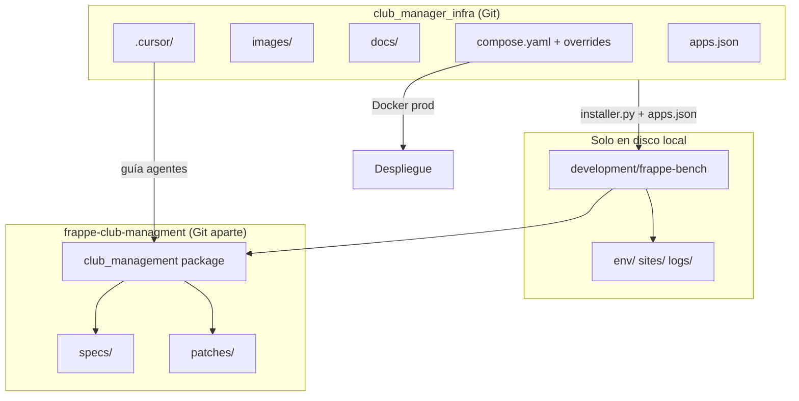

# Análisis del árbol `club_manager_infra` — estructura, funcionalidad y optimización

Documento generado a partir del estado del workspace en junio de 2026.  
**Tamaño total en disco:** ~1,7 GB (casi todo es el bench local, no el repo de infra).

---

## 1. Panorama general

Este workspace es en realidad **dos mundos superpuestos**:

| Capa | Qué es | Versionado en Git (`club-manager-infra`) | Tamaño aprox. |
|------|--------|------------------------------------------|---------------|
| **Infra** | Fork/adaptación de [frappe_docker](https://github.com/frappe/frappe_docker) + convenciones del club | Sí (~103 archivos) | ~2 MB |
| **Bench local** | Entorno Frappe/ERPNext + app `club_management` en tu máquina | No (`.gitignore`: `development/*` con excepciones) | ~1,7 GB |
| **App `club_management`** | Repo Git **separado** (`frappe-club-managment`) clonado dentro del bench | Repo propio, no el infra | ~25 MB (código) + deps |

Convención ya documentada en [`REPO_LAYOUT.md`](../../REPO_LAYOUT.md) y [`AGENTS.md`](../../AGENTS.md).

```text
club_manager_infra/                    ← repo infra (Docker, docs, CI)
├── compose.yaml, overrides/, images/  ← despliegue producción/demo
├── development/                       ← solo 4 archivos en Git; el resto es local
│   └── frappe-bench/                  ← bench completo (ignorado)
│       └── apps/
│           ├── frappe/     (~1 GB)
│           ├── erpnext/    (~153 MB)
│           └── club_management/  ← segundo repo Git (app del club)
├── docs/                              ← mayormente doc upstream frappe_docker + club
├── .cursor/                           ← reglas/skills Cursor (hoy sin commitear)
└── *.csv, scripts/                    ← datos/scripts ICDPE (hoy sin commitear)
```

---

## 2. Raíz del repositorio (infra)

### 2.1 Orquestación Docker (activos, núcleo del proyecto)

| Archivo / carpeta | Función |
|-------------------|---------|
| [`compose.yaml`](../../compose.yaml) | Compose base para **producción**: servicios backend, workers, configurator, volúmenes `sites`. |
| [`pwd.yml`](../../pwd.yml) | Demo **desechable** de ERPNext en un solo archivo (heredado de frappe_docker). No es el flujo de desarrollo del club. |
| [`docker-bake.hcl`](../../docker-bake.hcl) | Definición de build multi-etapa para imágenes Docker (CI y releases). |
| [`overrides/`](../../overrides/) | Fragmentos Compose que se combinan con `-f` para distintos escenarios (HTTPS, Traefik, Redis, **Postgres**, MariaDB, multi-bench, backups, etc.). |
| [`images/`](../../images/) | Dockerfiles/Containerfiles: `bench`, `custom`, `layered`, `production`. |
| [`resources/core/nginx/`](../../resources/core/nginx/) | Plantilla y entrypoint de Nginx para contenedores. |
| [`example.env`](../../example.env) | Plantilla de variables de entorno (sin secretos). |
| [`apps.json`](../../apps.json) | Lista de apps a instalar en un bench nuevo (Frappe 16, ERPNext, HRMS, `club_management`). |

**Recomendación:** Para el club, documentar explícitamente qué overrides usáis (p. ej. `compose.postgres.yaml` + `compose.redis.yaml`) y tratar el resto como **catálogo heredado** del upstream, no como código “muerto” pero sí como **bajo valor** si solo usáis Postgres.

### 2.2 Desarrollo y contenedor

| Archivo / carpeta | Función |
|-------------------|---------|
| [`development/installer.py`](../../development/installer.py) | Script Python para crear bench y sitio a partir de un `apps.json`. |
| [`development/apps-example.json`](../../development/apps-example.json) | Ejemplo mínimo (solo ERPNext v15). **Desalineado** con `apps.json` de la raíz. |
| [`development/vscode-example/`](../../development/vscode-example/) | Plantillas `launch.json`, `settings.json`, `tasks.json` para depurar en VS Code. |
| [`.devcontainer/`](../../.devcontainer/) | Devcontainer **activo** en tu máquina (`docker-compose.yml`, MariaDB por defecto, Postgres comentado). |
| `devcontainer-example/` (en Git, **borrado en disco**) | Plantilla upstream; la doc aún dice `cp -R devcontainer-example .devcontainer`. Estado inconsistente. |

**Sin función útil hoy:**

- `development/README.md` — listado en `.gitignore` como excepción (`!development/README.md`) pero **no existe** en disco.
- `development/logs/` — logs locales del installer; efímeros.

### 2.3 Calidad, CI y metadatos

| Archivo / carpeta | Función |
|-------------------|---------|
| [`.github/workflows/`](../../.github/workflows/) | CI upstream: build de imágenes, lint, pre-commit autoupdate, stale bot. |
| [`.github/scripts/`](../../.github/scripts/) | Scripts de mantenimiento (tags, `example.env`, `pwd.yml`). |
| [`tests/`](../../tests/) | Tests de integración del **stack Docker** frappe_docker (`test_frappe_docker.py`, helpers de conexión). No son tests de la app club. |
| [`.pre-commit-config.yaml`](../../.pre-commit-config.yaml), [`setup.cfg`](../../setup.cfg), [`requirements-test.txt`](../../requirements-test.txt) | Lint/format y deps de test del repo infra. |
| [`install_x11_deps.sh`](../../install_x11_deps.sh) | Solo para depuración con X11 en VM Linux (doc en `docs/05-development/01-development.md`). Nicho; no afecta al flujo Docker habitual. |

### 2.4 Documentación

| Carpeta | Función |
|---------|---------|
| [`docs/01-getting-started/` … `docs/08-reference/`](../../docs/) | Documentación **canónica de frappe_docker** (despliegue, producción, migraciones). |
| [`docs/getting-started.md`](../../docs/getting-started.md) | Guía larga (~33 KB) que solapa parcialmente con `01-getting-started/`. Heredada del upstream. |
| [`docs/05-development/club-management-dev.md`](../../docs/05-development/club-management-dev.md) | **Única doc específica del club** en infra: levantar devcontainer, QA Solicitud de Asociación. |
| [`docs/docs/`](../../docs/docs/) | Material contable ICDPE y PDFs API COBROS PLUS (referencia de negocio; hoy **sin trackear** en Git). |
| [`docs/images/`](../../docs/images/) | Capturas para doc Docker Desktop. |

### 2.5 Convenciones para agentes / equipo

| Archivo / carpeta | Función | En Git |
|-------------------|---------|--------|
| [`AGENTS.md`](../../AGENTS.md) | Reglas para desarrollo Frappe del club. | No (untracked) |
| [`REPO_LAYOUT.md`](../../REPO_LAYOUT.md) | Cómo conviven infra y app. | No (untracked) |
| [`.cursor/rules/`](../../.cursor/rules/) | Reglas Cursor (seguridad, SDD/TDD, dominio club, Docker). | No |
| [`.cursor/skills/`](../../.cursor/skills/) | Skills (frappe-developer, testing, infra-docker, QA, etc.). | No |
| [`.cursor/agents/`](../../.cursor/agents/) | Definición de subagentes backend/frontend. | No |

**Recomendación:** Versionar `.cursor/`, `AGENTS.md` y `REPO_LAYOUT.md` si queréis alinear al equipo (ya previsto en `REPO_LAYOUT.md`).

### 2.6 Datos contables ICDPE (raíz)

| Archivo | Función |
|---------|---------|
| `Chart of Accounts Importer - ICDPE.csv` | Plan de cuentas para importador ERPNext. |
| `Centro de costos - ICDPE.csv` (+ variantes `1 - grupos`, `2 - subcentros`) | Centros de costo en formato export ERPNext (español). |
| `Cost Centers - ICDPE.csv` | Misma información en formato alternativo (columnas distintas). |

**Posible redundancia:** Los CSV de centros de costo en español e inglés cubren el mismo dominio con formatos diferentes; conviene **un solo formato canónico** y el resto como derivados o archivar.

### 2.7 Scripts sueltos

| Archivo | Función |
|---------|---------|
| [`scripts/icdpe_create_service_items.py`](../../scripts/icdpe_create_service_items.py) | Script one-shot para crear Items de servicio ICDPE vía `bench execute`. |

**Duplicado:** El mismo script vive en la app en  
`development/.../club_management/setup/icdpe_create_service_items.py` (versión canónica para `bench execute club_management.setup.icdpe_create_service_items.run`). La copia en `scripts/` del infra es redundante si la app está instalada.

### 2.8 Archivos estándar de proyecto

`README.md`, `LICENSE`, `CODE_OF_CONDUCT.md`, `CONTRIBUTING.md`, `.editorconfig`, `.dockerignore`, `.gitignore`, `.vscode/extensions.json` — metadatos y convenciones; todos con función clara.

---

## 3. `development/frappe-bench/` (local, ~1,7 GB)

**No forma parte del contenido típico de un PR de infra.** Es el entorno de ejecución.

| Subcarpeta | Función | ¿Optimizable? |
|------------|---------|----------------|
| `apps/frappe/` (~1 GB) | Framework Frappe v16. No modificar (regla no-core-hacks). | No tocar; clon upstream. |
| `apps/erpnext/` (~153 MB) | ERPNext. No modificar. | Idem. |
| `apps/club_management/` (~25 MB) | App custom del club (repo Git propio). | Ver sección 4. |
| `env/` (~420 MB) | Virtualenv Python del bench. | Regenerable (`bench setup env`). No versionar. |
| `sites/` (~29 MB) | Sitios, assets compilados, `site_config.json`. | Datos locales; backup aparte. |
| `logs/` (~18 MB) | Logs de bench/workers. | Rotar o borrar. |
| `config/` | PIDs y config local. | Efímero. |

**Recomendaciones de optimización (disco y rendimiento IDE):**

1. Añadir a `.cursorignore` / exclusiones del editor: `development/frappe-bench/env/`, `sites/`, `logs/`, `apps/frappe/`, `apps/erpnext/`.
2. No intentar “limpiar” Frappe/ERPNext del árbol; el ahorro real está en **no indexar** y en **no commitear** el bench.
3. Si el bench se corrompe: `development/installer.py` + `apps.json` lo recrean; el valor está en Git de la **app**, no del bench.

**Inconsistencia detectada:** `apps.json` declara **HRMS**, pero en el bench local solo hay `frappe`, `erpnext` y `club_management`. HRMS no está instalado.

---

## 4. App `club_management` (repo separado)

Ruta del paquete Python:  
`development/frappe-bench/apps/club_management/club_management/`

### 4.1 Estructura funcional por módulo Frappe

| Módulo / carpeta | Función |
|------------------|---------|
| **`members/`** | Dominio principal: DocTypes (`Socio`, solicitudes, cuotas), APIs Desk, servicios de cobranza/morosos, workflows, workspace Secretaría, reportes, tests. |
| **`activities/`** | Actividades deportivas, equipos, aranceles, seeds ICDPE, workspace Gestión de Actividades. |
| **`integrations/`** | Cobros Plus / Supervielle (API, webhook, `Cobros Plus Settings`). |
| **`setup/`** | Scripts de instalación: cuotas, suscripciones mensuales, contabilidad ICDPE, creación de items. |
| **`patches/v1_0/`** (35 parches) | Migraciones one-shot: seeds, sync de workspaces, renombres de campos, links a reportes. Se ejecutan con `bench migrate`. |
| **`specs/`** (30 archivos) | Especificaciones Given/When/Then (SDD). Fuente de verdad antes del código. |
| **`www/`** | Páginas web públicas: solicitud de asociación, inscripción actividades, stub de pago. |
| **`public/`** | JS/CSS/bundles Desk (`club_management.bundle.js`, navegación, panel secretaría). |
| **`templates/`** | Plantillas Jinja web. |
| **`workspace_sidebar/`** | Sidebars Desk exportados (JSON). |
| **`tests/`** (raíz del paquete) | Tests transversales (p. ej. Supervielle). |
| **`hooks.py`** | Registro central: bundles, permisos app, schedulers, doc_events. |
| **`install.py`** | Lógica post-instalación de la app. |

### 4.2 Raíz del repo de la app (`apps/club_management/`)

| Elemento | Función |
|----------|---------|
| `pyproject.toml`, `package.json` | Deps Python y front (build de assets). |
| `e2e/`, `playwright.config.cjs` | Tests E2E del flujo solicitud (Playwright). |
| `scripts/` (`run-qa-e2e.sh`, etc.) | Automatización QA en contenedor. |
| `.github/` | CI de la app (propio del repo app). |
| `.cursor/` | Reglas duplicadas respecto al infra (revisar una sola fuente). |

### 4.3 Carpetas/archivos con poca o ninguna función

| Ruta | Observación |
|------|-------------|
| `club_management/club_management/club_management/` | Submódulo Frappe **“Club Management”** casi vacío: solo `__init__.py` y `.frappe`. Subcarpetas `integrations/` y `tests/` sin archivos fuente (solo `__pycache__`). **Candidato a eliminar** tras confirmar que ningún patch lo referencia. |
| `club_management/data/` | Directorio **vacío**. Sin uso. |
| `supervielle_api.py` (raíz del paquete) | **Shim de compatibilidad** para URL antigua del webhook; delega a `integrations/`. Tiene función mientras exista esa ruta pública. |
| `members/qa/` | Runners de QA supervisado (`run_supervised.py`); útiles en desarrollo, no en producción. |
| `node_modules/`, `playwright-report/`, `test-results/`, `.pw-browser-ready`, `.pw-channel.env` | Artefactos locales de Playwright; **no versionar** (deberían estar en `.gitignore` de la app). |
| `public/dist/` | Assets compilados; regenerables con build. |
| `**/__pycache__/` | Bytecode Python; ignorar. |

### 4.4 Parches y seeds

Los archivos en `patches/v1_0/` con prefijo `seed_`, `retire_`, `fix_` son **migraciones ya aplicadas** en sitios existentes. Siguen siendo necesarios para **nuevas instalaciones** y `bench migrate`, pero no hay que editarlos salvo bugs de migración. No son “código muerto”.

---

## 5. Resumen: qué no tiene función (o es redundante)

### En el repo infra (versionado o no)

| Elemento | Veredicto |
|----------|-----------|
| `devcontainer-example/` eliminado en disco pero aún en índice Git | Inconsistente; restaurar o actualizar doc/CI. |
| `development/README.md` | Referenciado en `.gitignore` pero **no existe**. |
| `scripts/icdpe_create_service_items.py` | Duplicado de la app en `setup/`. |
| CSV duplicados de centros de costo (ES vs EN) | Redundancia de formato; elegir uno canónico. |
| Overrides MariaDB (`compose.mariadb*.yaml`) | Sin uso si el club estandariza **PostgreSQL v14**. |
| `pwd.yml` + workflows de demo | Sin uso si no hacéis demo pública ERPNext. |
| `install_x11_deps.sh` | Solo debugging X11; opcional. |
| `development/apps-example.json` (ERPNext v15 solo) | Desactualizado respecto a `apps.json`. |

### En el bench local (ignorado por Git infra)

| Elemento | Veredicto |
|----------|-----------|
| `env/`, `logs/`, gran parte de `sites/` | Efímeros; seguros de borrar con recreación de bench. |
| `apps/frappe`, `apps/erpnext` | Upstream; no son “del proyecto”. |

### En la app `club_management`

| Elemento | Veredicto |
|----------|-----------|
| `club_management/club_management/club_management/` (anidado vacío) | Sin función aparente. |
| `data/` vacío en raíz del paquete | Sin función. |
| Artefactos Playwright / `node_modules` | Basura local de QA. |

---

## 6. Recomendaciones de optimización (priorizadas)

### Prioridad alta (organización y claridad)

1. **Alinear devcontainer:** O bien commitear `.devcontainer/` (y quitar `devcontainer-example` del historial/doc), o restaurar `devcontainer-example/` y mantener `.devcontainer` como copia local gitignored. Actualizar `club-management-dev.md` y `infra-docker.mdc` para un solo camino.
2. **Versionar convenciones del equipo:** `.cursor/`, `AGENTS.md`, `REPO_LAYOUT.md`, `docs/club/`, CSVs/scripts ICDPE si son referencia oficial del club.
3. **Unificar `apps.json`:** Misma lista en raíz y `development/apps-example.json`; instalar o quitar HRMS del manifest.
4. **Eliminar duplicados:** Borrar `scripts/icdpe_create_service_items.py` del infra o dejar solo un README que apunte al módulo `club_management.setup`.
5. **Mover datos ICDPE** de la raíz a `resources/import-templates/icdpe/` (como sugiere `REPO_LAYOUT.md`).

### Prioridad media (mantenimiento)

6. **Podar módulo vacío** `club_management/club_management/club_management/` en la app (con test de migrate).
7. **Separar documentación:** `docs/frappe-docker/` (upstream) vs `docs/club/` (ICDPE, SIRO, flujos secretaría) para no mezclar forks con guías propias.
8. **`.cursorignore`:** Excluir bench pesado del indexado del IDE.
9. **PostgreSQL en devcontainer:** Si producción y reglas del proyecto son PG v14, descomentar Postgres en `.devcontainer/docker-compose.yml` y documentar; reducir confusión con overrides MariaDB.
10. **Git submodule** (opcional): Fijar revisión de `club_management` en el infra si necesitáis reproducibilidad entre máquinas.

### Prioridad baja (limpieza)

11. Revisar workflows `.github/` heredados: desactivar los que no uséis (build stable/develop si solo construís imagen custom).
12. Consolidar CSV de centros de costo a un formato.
13. Crear `development/README.md` con enlace a `docs/05-development/club-management-dev.md` o eliminar la excepción del `.gitignore`.
14. En la app: asegurar `.gitignore` para `playwright-report/`, `test-results/`, `.pw-*`, `node_modules/`.

---

## 7. Diagrama de dependencias conceptuales



---

## 8. Checklist rápido para nuevos contribuidores

- **¿Dónde va código de negocio?** → Repo `frappe-club-managment`, no infra.
- **¿Dónde va Docker/Compose?** → Raíz de `club_manager_infra`.
- **¿Qué no commitear en infra?** → Casi todo `development/frappe-bench/` excepto installer y vscode-example.
- **¿Qué commitear que hoy falta?** → `.cursor/`, docs club, plantillas ICDPE (si el equipo lo acuerda).
- **¿Qué borrar sin miedo en local?** → `env/`, `logs/`, reportes Playwright; **no** borrar `apps/club_management` sin backup del repo app.

---

*Para convenciones de desarrollo de la app, ver [`AGENTS.md`](../../AGENTS.md). Para layout de repos, ver [`REPO_LAYOUT.md`](../../REPO_LAYOUT.md).*
