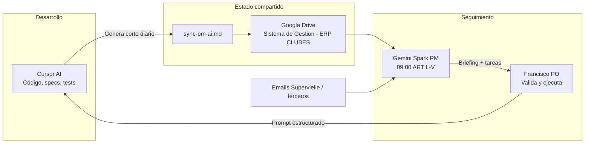

# Protocolo de sincronización Cursor AI ↔ PM AI (Gemini Spark)

**Proyecto:** SICLUB / ICDPE Pedro Echagüe  
**Product Owner:** Francisco  
**PM AI:** Gemini Spark (tarea programática L–V 09:00 ART)  
**Artefacto de corte:** [`sync-pm-ai.md`](sync-pm-ai.md)

---

## 1. Arquitectura del flujo



**Roles**

| Actor | Responsabilidad |
|-------|-----------------|
| **Cursor AI** | Relevar git + código + specs; clasificar Done/In Progress/Backlog; escribir `sync-pm-ai.md`. |
| **Google Drive** | Fuente de verdad del **estado diario** para el PM (carpeta *Sistema de Gestion - ERP CLUBES*). |
| **Gemini Spark** | Leer sync + contexto (emails Supervielle, etc.); emitir briefing ejecutivo y tareas priorizadas. |
| **Francisco (PO)** | Validar, copiar prompt de sesión a Cursor, ejecutar decisiones de producto. |

**Cadencia:** al menos **un corte por día hábil** antes de las 09:00 ART, o **al cerrar un hito** (deploy, go-live, merge de sprint).

---

## 2. Protocolo diario en 3 pasos

### Paso 1 — Cursor genera el sync (mañana o post-hito)

Disparadores en chat:

- «Generar sync para PM»
- «Actualizar sync-pm-ai»
- «Sincronizar estado con PM AI»
- Al finalizar un hito acordado (deploy prod, cierre de épica, merge de rama)

Checklist obligatorio:

1. **Relevar git** — rama actual, último commit en `origin`, working tree dirty/untracked, stashes, gap local→prod (Hetzner).
2. **Contrastar código vs specs** — clasificar cada ítem en: **Done (prod)**, **Done (código)**, **In Progress**, **Backlog**.
3. **Blockers y dependencias** — APIs sin documentar, datos de terceros (FMV, Excel Coordinación), credenciales, HEAD prod no verificado.
4. **Escribir/actualizar** [`sync-pm-ai.md`](sync-pm-ai.md) con el formato estándar (ver §3).

Repos a inspeccionar:

| Repo | Ruta local típica |
|------|-------------------|
| App Frappe | `development/frappe-bench/apps/club_management/` |
| Infra | raíz `club_manager_infra/` |
| Landing Vercel | `../pedro-echague-landing-page/` |

Backlog de referencia: `club_management/specs/backlog_implementacion.md`.

### Paso 2 — Publicar en Drive

```bash
# Recomendado al cerrar sesión (bitácora + sync)
./scripts/publish-dev-session.sh

# Solo sync (legacy)
./scripts/sync-pm-ai-to-drive.sh
# Copia con historial por fecha:
./scripts/sync-pm-ai-to-drive.sh --dated
```

**Automático:** al cerrar sesión en Cursor, el hook `sessionEnd` (`.cursor/hooks.json`) ejecuta `publish-dev-session.sh`.

Archivos en Drive (carpeta [**Sistema de Gestion - ERP CLUBES**](https://drive.google.com/drive/folders/1KAvGKTnyjkZ_RDjwyxe_c6E3teS0RWtQ)):

| Archivo | Rol |
|---------|-----|
| `sync-pm-ai.md` | Corte PM → Gemini Spark (09:00 ART) |
| `Bitacora de desarrollo.md` | Bitácora de desarrollo (generada desde §0 del sync) |

Setup rclone: [`rclone-gdrive-setup.md`](rclone-gdrive-setup.md).

**Backends:** `rclone` (si `RCLONE_REMOTE` está definido) o Google Drive API (`pip install -r scripts/requirements-sync-drive.txt`). Ver `docs/club/example.sync-pm-ai.env`.

Windows (si WSL sin HTTPS):

```powershell
.\scripts\sync-pm-ai-to-drive.ps1
# Primera vez con config WSL: -CopyConfigFromWsl
```

Pasos manuales (alternativa):

1. Copiar o subir `docs/club/sync-pm-ai.md` y `docs/club/bitacora-de-desarrollo.md` a Google Drive → **Sistema de Gestion - ERP CLUBES**.
2. Mantener **un solo archivo** de corte (sobrescribir el anterior) o nombrar con fecha si el PM requiere historial: `sync-pm-ai-YYYY-MM-DD.md`.
3. Opcional: commit en `club-manager-infra` si el equipo versiona el sync en Git (no obligatorio para Gemini).

### Paso 3 — Gemini briefing → sesión Cursor (09:00 ART)

1. **Gemini Spark** lee el sync en Drive + emails Supervielle y emite briefing + tareas del día.
2. **Francisco** valida prioridades y pega en Cursor un **prompt estructurado** para la sesión de desarrollo.
3. Al cerrar la sesión o un hito, volver al **Paso 1**.

---

## 3. Formato estándar de `sync-pm-ai.md`

El archivo debe incluir siempre estas secciones (en este orden):

| # | Sección | Contenido mínimo |
|---|---------|------------------|
| 0 | Metadatos | Fecha de corte, audiencia, fuentes, advertencia «no es plan nuevo» |
| — | Cómo leer | Tabla semáforo Done (prod) / Done (código) / In Progress / Backlog |
| — | Repos + HEAD | Commits relevantes por repo |
| — | Gap local→prod | Qué está en código pero no en Hetzner |
| 1 | Avances reales | Arquitectura, socios, tarifas/cobranza, pasarela, módulos en curso |
| 2 | Prioridades | P0…Pn ordenadas; qué subió y qué bajó |
| 3 | Reglas de negocio | Cambios desde último corte |
| 4 | Blockers | Técnicos, producto, dependencias externas |
| 5 | Mapa DocTypes | Opcional, útil para PM |
| 6 | Mensaje corto | 5 líneas para pegar en Gemini |
| 7 | Referencias | Links a specs clave |

**Reglas de redacción**

- Español, hechos verificables (git, specs, URLs prod).
- No inventar estado de pasarela ni endpoints Cobrand/Supervielle.
- SIRO = retirado; online = Cobrand + Banco Supervielle cuando haya doc API.
- Distinguir siempre **prod Hetzner** vs **solo local**.

---

## 4. Prompt tipo para Gemini Spark (plantilla)

```text
Leé el archivo sync-pm-ai.md en Drive (carpeta Sistema de Gestion - ERP CLUBES).
Fecha de corte: [YYYY-MM-DD].

Entregá:
1. Briefing ejecutivo (5 bullets).
2. Top 3 tareas para hoy con criterio de Done.
3. Blockers que requieren decisión del PO.
4. Riesgos si no se deploya lo que está solo en local.

Contexto adicional: [emails Supervielle / reuniones / decisiones del PO].
```

---

## 5. Prompt tipo para sesión Cursor (desde briefing Gemini)

```text
Sesión de desarrollo ICDPE — [fecha]

Prioridad del PM:
1. [tarea]
2. [tarea]
3. [tarea]

Restricciones: SDD+TDD, no tocar frappe/erpnext, PostgreSQL v14.
Blockers a resolver hoy: [lista]

Al cerrar hito: generar sync para PM y actualizar sync-pm-ai.md.
```

---

## 6. Referencias en el repo

| Recurso | Ubicación |
|---------|-----------|
| Corte vigente | `docs/club/sync-pm-ai.md` |
| **Script publicación Drive** | `scripts/sync-pm-ai-to-drive.sh` |
| Plantilla env | `docs/club/example.sync-pm-ai.env` |
| Regla Cursor | `.cursor/rules/sync-pm-ai.mdc` |
| Skill agente | `.cursor/skills/sync-pm-ai/SKILL.md` |
| Backlog specs | `club_management/specs/backlog_implementacion.md` |
| Cobranza online | `docs/club/cobranza-cobrand-supervielle.md` |
